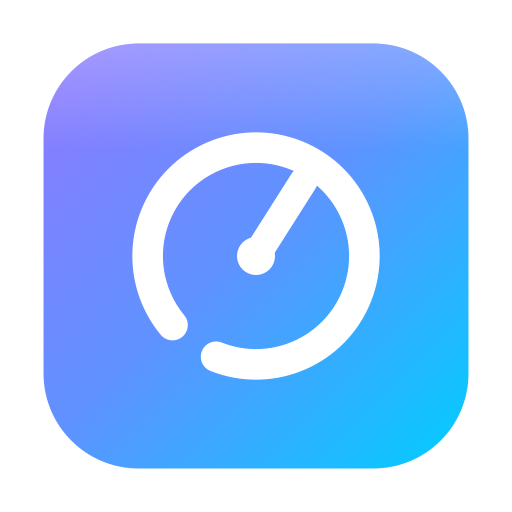
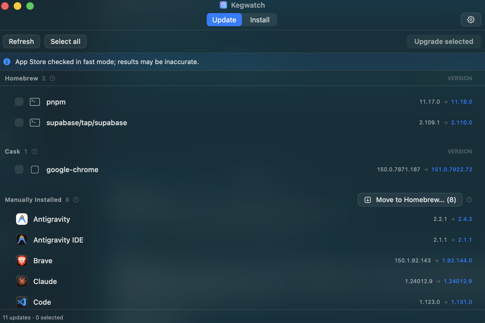
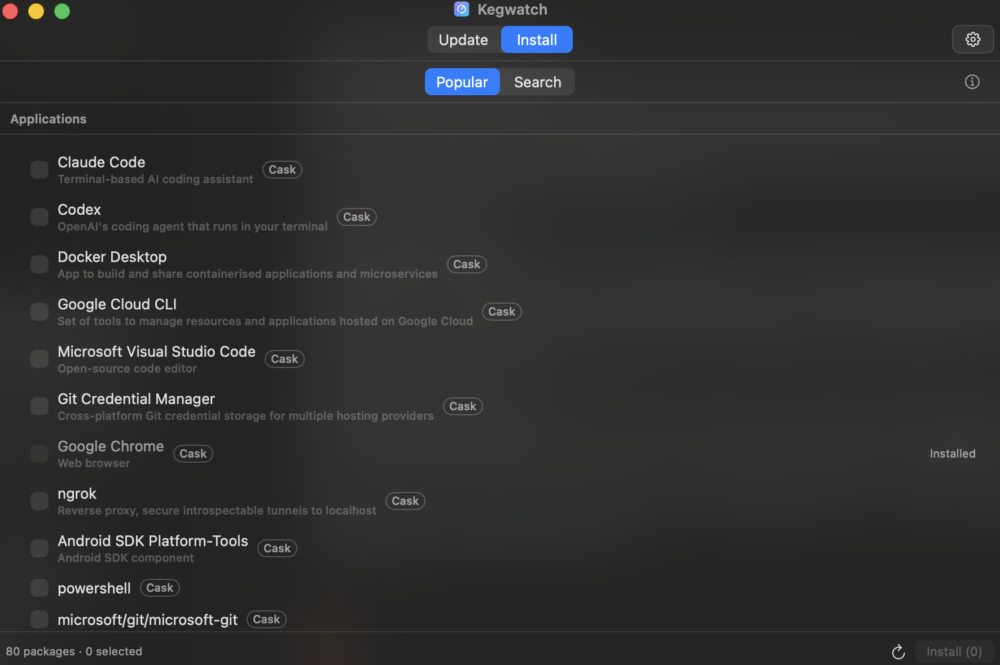
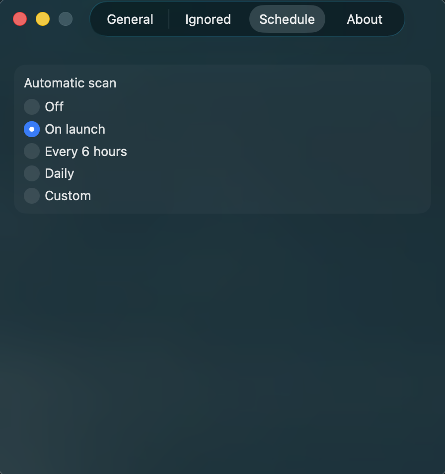

# Kegwatch

**Keep every app on your Mac up to date — from one place.**

[**⬇︎ Download the latest release**](https://github.com/replikduplik/kegwatch-releases/releases/latest)

---

Kegwatch scans your Mac for outdated apps across **Homebrew**, **Homebrew Cask**, the **Mac App Store**, and apps with their own updaters (**Sparkle / Electron**), and updates them in one click. It can also adopt hand-installed apps into Homebrew, install new apps, and run on a schedule — all free.

## ✨ Features

- 🔄 **One place for every update** — Homebrew, Cask, Mac App Store, and Sparkle/Electron feeds in a single list.
- 📥 **Move to Homebrew** — hand a manually-downloaded app (if it has a cask) to Homebrew without reinstalling. Future updates then show up automatically.
- 🧩 **Install new apps** — browse popular apps or search Homebrew, and install right from Kegwatch.
- ⏰ **Automatic scans** — on launch, every few hours, daily, or a custom schedule, with notifications when updates are found.
- 📊 **Menu bar** — pending updates at a glance, without opening the app.
- ⬆︎ **Self-updating** — Kegwatch keeps itself up to date.
- 🆓 **Free.**

## 📸 Screenshots

  

  

## ⬇︎ Install

1. Download the latest **Kegwatch.dmg** from the [Releases page](https://github.com/replikduplik/kegwatch-releases/releases/latest).
2. Open the .dmg and drag **Kegwatch** into your **Applications** folder.
3. Launch it — it's notarized by Apple, so no security warnings.

**Requires macOS 15 (Sequoia) or later.**

## ⚙️ How it works

- **Scan** — Kegwatch checks Homebrew, Cask, the Mac App Store (via `mas`), and app update feeds for newer versions.
- **Update** — install available updates in one click. Mac App Store items open the App Store's Updates page.
- **Adopt** — a manually-installed app that exists as a Homebrew cask can be moved under Homebrew management, so you never update it by hand again.

## 🗒 Changelog

Kegwatch updates itself. See what's new in each version on the [Releases page](https://github.com/replikduplik/kegwatch-releases/releases).

---

Made with 🍺 by Çağdaş Şahin

